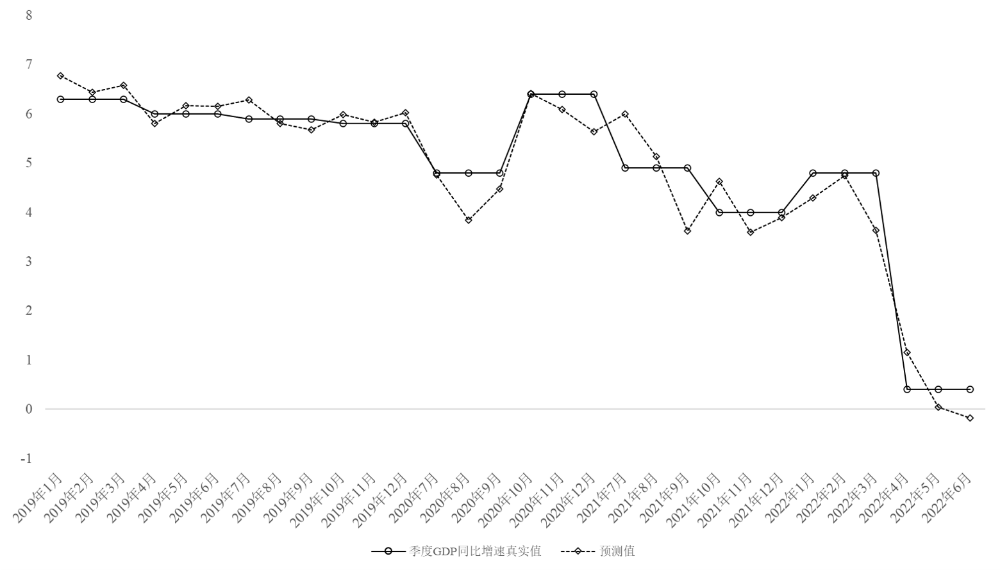

## Nowcast year-on-year growth rate of quarterly GDP in China
### Introduction
This project nowcasts year-on-year GDP growth rate of the current quarter and predicts that of the future mutiple periods. Based on nowcasting package in R which forecasts month-on-month GDP growth, we rewrite nowcast function for year-on-year GDP growth. 

This project includes processing data, transforming indicators and forecasting the curent and future quarterly GDP growth.

### Data
According to release time of economic indicators, the dataset at a specific moment can be available. We obtain mixed frequency sample data at 10 day intervals, in which daily indicators are transformed into monthly indicators by taking the monthly average year-on-year ratio. The meaning, transformation, frequency of every indicator are listed in file Spec_ele.xlsx, where these block variables indicate whether every indicator belongs to them. For example, indicators whose Block2-Soft varible is equal to 1 implies they are soft varible.

### Model
We build mixed-frequency dynamic factor model for monthly and quarterly year-on-year data. Use factor model to extract common factors from all economic indicators and use auto-regression model to describe dynamism of factors. We transform two models into the form of state space. Based on Kalman filter and smooth, we can calculate likelihood function, and EM Method is used to obtain Maximum Likelihood Estimation of unkown parameters. 

### Forcast
Based on kalman filter and smooth, we can calculate the estimated and predicted values of common factors. By the estimator of loading matrix in the factor model, we can calculate the forecast of GDP growth. 

With the continuous release of monthly indicators data within the quarter, the predicted value gradually approaches the true value.